# AiHarness User Guide

AiHarness provides two interfaces on top of the same providers and session storage:

- **CLI**: interactive agent in a terminal, with sessions, branches, tools, skills, and extensions;
- **Web**: three-panel React workspace connected to a detached server agent with sequenced SSE recovery.

This guide covers installation from sources, provider configuration, and daily use of both interfaces.

## Table of Contents

- [Installation](#installation)
- [Quick Start](#quick-start)
- [Provider Configuration](#provider-configuration)
- [Using the CLI](#using-the-cli)
- [Using the Web Interface](#using-the-web-interface)
- [Sessions and Files](#sessions-and-files)
- [Security](#security)
- [Troubleshooting](#troubleshooting)

## Installation

### Prerequisites

- Node.js 22.22.2+, 24.15.0+ or 26+;
- npm 12.1.0+;
- an API key or a local OpenAI-compatible server to use a real model.

The **mock** provider is available without configuration to explore the application.

### Installation from Sources

```bash
git clone https://github.com/Fidigi/AiHarness.git
cd AiHarness
npm install
npm run link:global
```

### Install the `ai-harness` and `ai-harness-web` Commands

The `npm run link:global` command builds the project and installs two executables linked to this repository:

- `ai-harness` for the terminal;
- `ai-harness-web` for the full Web application.

You can then launch them from any folder. Verify that npm's global folder is in your PATH if a command remains unfound.

Global links point to this repository. After modifying code, rerun `npm run build`; there is no need to recreate the links.

## Quick Start

### Terminal

```bash
ai-harness
```

### Web

```bash
ai-harness-web
```

The browser opens automatically at [http://127.0.0.1:3080](http://127.0.0.1:3080). Use `Ctrl+C` to stop the server.

## Provider Configuration

Variables must be set **before** starting the CLI or Web server.

| Provider | Main Variables | Optional Variables |
|---|---|---|
| OpenAI | `OPENAI_API_KEY` | `OPENAI_MODEL` in RPC mode |
| Anthropic | `ANTHROPIC_API_KEY` | `ANTHROPIC_MODEL` in RPC mode |
| Google Gemini | `GEMINI_API_KEY` or `GOOGLE_API_KEY` | `GEMINI_MODEL` |
| Azure OpenAI | `AZURE_OPENAI_API_KEY`, `AZURE_OPENAI_ENDPOINT` | `AZURE_OPENAI_DEPLOYMENT`, `AZURE_OPENAI_API_VERSION` |
| Google Vertex AI | `GOOGLE_VERTEX_ACCESS_TOKEN`, `GOOGLE_CLOUD_PROJECT` | `GOOGLE_CLOUD_LOCATION`, `VERTEX_MODEL` |
| AWS Bedrock | `AWS_ACCESS_KEY_ID`, `AWS_SECRET_ACCESS_KEY` | `AWS_SESSION_TOKEN`, `AWS_REGION`, `BEDROCK_MODEL` |
| Local / Ollama / llama.cpp / AirNES | `LOCAL_BASE_URL` or `LLAMA_BASE_URL` | `LOCAL_API_KEY`/`LLAMA_API_KEY`, `LOCAL_MODEL`/`LLAMA_MODEL` |

OpenAI example:

```bash
export OPENAI_API_KEY='sk-...'
```

Ollama example:

```bash
export LOCAL_BASE_URL='http://127.0.0.1:11434/v1'
export LOCAL_MODEL='qwen2.5-coder'
```

AirNES example:

```bash
export LLAMA_BASE_URL='http://127.0.0.1:8888'
export LLAMA_API_KEY='llama-cpp'
export LLAMA_MODEL='Qwen3.6-35B-A3B-UD-IQ4_XS'
```

AiHarness automatically appends `/v1` to the local URL on the server side when needed.

## Using the CLI

### Starting Up

After global installation as described above, the normal command is:

```bash
ai-harness
```

To work directly from sources without a global link:

```bash
npm run dev:cli
```

After `npm run build`, you can also call the compiled file directly:

```bash
node packages/cli/dist/index.js
```

The active provider at startup is **mock**. Select a configured provider before a real conversation:

```text
/provider
/provider openai
/model
/model gpt-4o
```

Then type a message and press Enter. The response displays progressively.

### Launch Options

| Option | Effect |
|---|---|
| `-h`, `--help` / `-v`, `--version` | prints command metadata without starting a session |
| `-p`, `--print` | runs supplied prompts once and writes only the final answer to stdout |
| `--mode json` | runs supplied prompts once and writes session/lifecycle events as JSONL |
| `--mode rpc` or `--rpc` | enables the JSONL RPC protocol on stdin/stdout |
| `--tui-mode fullscreen` / `regular` | selects the terminal mode |
| `--fullscreen` / `--regular` / `--no-fullscreen` | legacy terminal-mode aliases |
| `--provider <name>` | constrains `--model` or `--models` to a provider |
| `--model <[provider/]model[:thinking]>` | selects an exact/fuzzy model and optional thinking level |
| `--models <patterns>` | sets an ordered startup and interactive/RPC cycling scope with exact/fuzzy references or globs |
| `--list-models [search]` | prints configured-provider model metadata, optionally fuzzy-filtered, then exits |
| `--api-key <key>` | applies a non-persistent credential override; requires `--model` or `--models` |
| `--thinking <level>` | selects `off`, `minimal`, `low`, `medium`, `high`, `xhigh`, or `max` |
| `--system-prompt <text-or-path>` | replaces the default system prompt with literal text or an existing file |
| `--append-system-prompt <text-or-path>` | appends literal text or an existing file; repeatable and order-preserving |
| `-nc`, `--no-context-files` | disables automatic `AGENTS.md` / `CLAUDE.md` discovery |
| `-c`, `--continue` | continues the newest session for the current workspace |
| `-r`, `--resume` | opens an interactive stored-session selector |
| `--session <path-or-id>` | opens an exact file, ID, or ID prefix |
| `--session-id <id>` | opens or creates an exact validated ID |
| `--fork <path-or-id>` | forks a stored session before startup |
| `--session-dir <directory>` | overrides the session storage/lookup directory |
| `-n`, `--name <name>` | names or renames the startup session |
| `--no-session` | keeps conversation in memory only |
| `--theme dark` / `--theme light` | selects a built-in theme |
| `--theme <file.json>` | loads a custom theme |
| `--extension <file-or-folder>` | loads an explicit JavaScript extension; repeatable option |

Examples:

```bash
ai-harness --tui-mode regular --theme light
ai-harness --print --no-session "Summarize this repository"
git diff | ai-harness --print --no-session "Review this patch"
ai-harness --print --no-session @README.md "Summarize this file"
ai-harness --mode json --no-session "Review this repository"
ai-harness --list-models "sonnet 4"
ai-harness --models 'openai/o*:high,anthropic/*sonnet*:medium' --mode rpc
ai-harness --system-prompt ./SYSTEM.md --append-system-prompt "Prefer small changes"
ai-harness --continue "Follow up on the previous work"
ai-harness --session-id review-42 --name "Review 42"
ai-harness --fork review-42 --session-id review-42-alternative
```

Positional prompts are sent in order. `@path` resolves inside the startup workspace and accepts bounded UTF-8 text or PNG/JPEG/GIF/WebP images; traversal, escaping symbolic links, binary text, and oversized inputs are rejected. Redirected stdin or stdout automatically selects print mode. Unknown options are errors; use `--` before a prompt that starts with `-`.

Model resolution checks the complete ID before treating its last colon as a thinking suffix, so IDs containing `/` or `:` remain valid. A bare ID shared by providers resolves only when exactly one matching provider is configured; otherwise qualify it. Fuzzy lookup prefers an undated/`-latest` alias, then the lexically newest ID. Scope patterns are ordered, deduplicated and support case-insensitive `*`, `?` and bracket globs; their first available match starts the run unless `--model` selects another, and `/model cycle` plus RPC reuse that scope. Discovery is timeout- and result-bounded. Catalogues and sessions never retain `--api-key`, but command-line secrets may remain visible in shell history or process listings, so prefer provider environment variables for durable credentials.

Without a session selector, each invocation starts a new session. `--resume` requires an interactive terminal; use `--session` or `--continue` in print/JSON automation. An explicit session path wins; otherwise storage precedence is `--session-dir`, `AI_HARNESS_SESSIONS_DIR`, settings `sessionDir`, then the default directory. Incompatible selectors fail before execution.

The `AI_HARNESS_TUI_MODE=regular|fullscreen` variable also sets the mode. The command-line option takes priority over settings.

### Agent Settings

The CLI and RPC use AiHarness's Core settings resolver. They read user settings from `<agent-directory>/settings.json` (`AI_HARNESS_AGENT_DIR`, otherwise `~/.ai-harness`) and, after explicit project trust, overlay `<workspace>/.ai-harness/settings.json`. The only project value read before trust is `sessionDir`. Files must be regular nonsymlink UTF-8 JSON and are capped at 256 KiB; invalid or unknown fields produce a warning without printing their values. Settings are read-only: AiHarness never rewrites them.

A useful starting file is:

```json
{
  "defaultProvider": "mock",
  "defaultModel": "mock-model-v1",
  "defaultThinkingLevel": "medium",
  "enabledModels": ["mock/*", "openai/o*:high"],
  "defaultTools": ["read", "bash", "edit", "write", "+grep"],
  "sessionDir": "./sessions",
  "compaction": { "enabled": true, "reserveTokens": 16384, "keepRecentTokens": 20000 },
  "retry": { "enabled": true, "maxRetries": 3, "baseDelayMs": 2000 },
  "steeringMode": "one-at-a-time",
  "followUpMode": "one-at-a-time",
  "tuiMode": "fullscreen",
  "theme": "system"
}
```

Also implemented are exact `modelThinkingLevels`, compaction `modelOverrides`, `externalEditor`, `quietStartup: true`, `shellPath`, `shellCommandPrefix`, local extension/skill/prompt paths, `enableSkillCommands`, and project `defaultTools` modifiers. Explicit CLI options take priority. Use `/settings` to inspect effective values and `global`/`project` sources. `/reload` refreshes settings, instructions, resources, extensions, tool defaults and shell callbacks; restart to change the session directory, startup model, renderer/theme, queues, compaction or retry policy. Package installation, built-in extension switches, custom theme resources, branch-summary generation, codemode, network/proxy/transport/provider retry, detailed terminal/image/Markdown options, telemetry and warning settings are not yet applied.

### Project Instructions and System Prompts

AiHarness applies the same instruction resolver in interactive, print, JSON, RPC, and Web agent runs. Its user-level agent directory is `AI_HARNESS_AGENT_DIR`, or `~/.ai-harness` when that variable is unset. In that directory, and then in each trusted ancestor from the filesystem root to the startup folder, it selects the first existing filename from this priority list:

1. `AGENTS.override.md`
2. `AGENTS.md`
3. `AGENTS.MD`
4. `CLAUDE.md`
5. `CLAUDE.MD`

The agent-directory file is user-owned and may load before project trust. Ancestor/project files load only after the workspace has been explicitly approved. If you run `/trust add` inside an active CLI, run `/reload` to recompute the instructions. `--no-context-files` disables both user and project context-file discovery, but does not disable `SYSTEM.md` or `APPEND_SYSTEM.md`.

For the base system prompt, `--system-prompt` has highest priority, then trusted `<workspace>/.ai-harness/SYSTEM.md`, then `<agent-directory>/SYSTEM.md`, then the built-in prompt. Without explicit append flags, trusted `<workspace>/.ai-harness/APPEND_SYSTEM.md` takes priority over `<agent-directory>/APPEND_SYSTEM.md`. Repeating `--append-system-prompt` replaces that automatic append-file choice and preserves command-line order. An existing CLI value is read as a path; a nonexistent value is used as literal text. The Web system-prompt setting is always literal, so it cannot unexpectedly read a server path.

Instruction sources must be regular, nonsymlink UTF-8 files and are bounded per file and in aggregate. Their resolved contents are sent to the selected provider but are not copied into session settings. Review project instruction files before trusting a workspace, because they can influence model decisions and tool requests even though tool execution keeps its own trust checks.

### Shortcuts and Input

| Action | Shortcut/command |
|---|---|
| Send input | Enter |
| Complete a command, skill or prompt | Tab |
| Browse input history | Up / Down |
| Interrupt an ongoing response or shell command | Ctrl+C |
| Quit when no operation is active | Ctrl+C, Ctrl+D or /quit |
| Open $VISUAL or $EDITOR | Ctrl+G |
| Refresh the screen | Ctrl+L |
| Scroll transcript in fullscreen | Alt+Up / Alt+Down |

For multi-line input in classic terminal:

```text
/edit
first line
second line
/send
```

Use `/cancel` to abandon multi-line input.

Prefix input with `!` to run a command directly in the trusted workspace. Its progressive output, status and exit code are persisted in session history and added to model context. Use `!!` to keep the same history without sending the result to the model:

```text
!git status
!!git diff --stat
```

`Ctrl+C` stops the active process tree. Displayed and persisted output is bounded; when truncated, the CLI shows an owner-only complete-output file that expires after 24 hours. Commands reject an untrusted workspace (`/trust add`), and child processes do not inherit environment variables whose names look like credentials. Direct CLI and Web commands use the same Core runtime; this path remains separate from the model-invoked `bash` tool.

### Conversation and Session Commands

| Command | Description |
|---|---|
| `/help` | displays built-in help |
| `/new [title]` | creates and activates a conversation |
| `/list [search]` | lists or filters conversations |
| `/switch <id-or-number>` | activates a conversation |
| `/name <title>` or `/rename <title>` | renames the active conversation |
| `/delete <id>` | deletes a conversation |
| `/clear` | clears messages from current conversation |
| `/session [-a|--all]` | displays statistics and token estimate |
| `/search <text>` | searches in displayed transcript |
| `/copy` | copies last response to clipboard |
| `/quit` or `/exit` | quits AiHarness |

### Provider, Model and Thinking

| Command | Description |
|---|---|
| `/provider` | displays available providers and their status |
| `/provider <name>` | selects openai, anthropic, google, local, azure, vertex, bedrock or mock if available |
| `/model` or `/model list` | displays the current model and active provider catalogue |
| `/model <[provider/]name[:thinking]>` | chooses an exact/fuzzy model, including across configured providers |
| `/model cycle` | switches to the next model in the ordered `--models` scope, or the active provider catalogue |
| `/thinking [off\|minimal\|low\|medium\|high\|xhigh\|max]` | displays or changes thinking level |
| `/login <provider>` | starts an OAuth Device Flow if configured |
| `/config` | displays session location |
| `/settings` | displays effective agent settings and source scopes |

Actual support for a thinking level depends on the provider and model.

For `/login openai`, set:

```bash
export AI_HARNESS_OAUTH_OPENAI_DEVICE_URL='https://.../device'
export AI_HARNESS_OAUTH_OPENAI_TOKEN_URL='https://.../token'
export AI_HARNESS_OAUTH_OPENAI_CLIENT_ID='...'
export AI_HARNESS_OAUTH_OPENAI_SCOPE='...' # optional
```

The prefix follows the form `AI_HARNESS_OAUTH_<PROVIDER>_*`.

### Built-in Coding Tools

The CLI and Web agent use the same tool implementations from the Core package:

| Tool | Purpose |
|---|---|
| `read` | reads a text-file window with `offset` and `limit` |
| `grep` | searches files for a regular expression or literal string |
| `find` | finds files by glob |
| `ls` | lists a directory |
| `edit` | applies exact, unique, non-overlapping text replacements |
| `write` | creates or completely rewrites a file |
| `bash` | runs a bounded shell command in the workspace |
| `powershell` | Windows equivalent, available only on that OS |

By default the model receives `read`, `bash`, `edit`, and `write`, plus loaded extension tools; `grep`, `find`, and `ls` are opt-in. The `defaultTools` agent setting can replace or modify that list. `--tools <names>` replaces the selection, `--exclude-tools <names>` removes names afterward, `--no-builtin-tools` keeps only extension tools, and `--no-tools` disables all defaults. `/tools` marks inactive tools, and `/reload` reapplies the policy to the new extension generation. Agent settings `shellPath` and `shellCommandPrefix` affect both this `bash` tool and direct `!`/`!!` commands.

Every path is canonicalized inside the directory from which the CLI started; escaping symlinks and traversal are rejected. Reads and searches do not execute code. `bash`, `edit`, and `write` require explicit trust:

```text
/trust add
/tools
/tool read {"path":"README.md","offset":1,"limit":80}
```

File reads, searches, listings, and command output are bounded so they cannot exhaust the model context. The `read` tool remains text-only, but startup `@image.png` inputs use the shared multimodal message/provider pipeline.

### Branches and Context

| Command | Description |
|---|---|
| `/compact [instructions]` | summarizes a long conversation with the active provider |
| `/summarize-branch [session-id] [instructions]` | saves a summary without deleting messages |
| `/fork <session-id> [message-index] [title]` | creates a branch from a message |
| `/clone <session-id> [title]` | copies an entire conversation |
| `/tree [branch-id]` | displays the tree and branch summaries |

Compaction requires a configured provider and at least three messages.

### Import, Export and Sharing

```text
/export json [path]
/export markdown [path]
/export jsonl [path]
/export html [path]
/import <file.jsonl>
/share [duration-in-hours]
/bug [description]
```

Without a path, exports are created in `~/.ai-harness/exports/`. The `/import` command accepts JSON containing an array of sessions or JSONL with one message per line.

**/share** requires the AiHarness server. By default, the CLI calls it on `http://127.0.0.1:3080`. Useful variables are:

```bash
export AI_HARNESS_SERVER_URL='http://127.0.0.1:3080'
export AI_HARNESS_AUTH_TOKEN='...'       # if the server is protected
export AI_HARNESS_ISSUES_URL='https://github.com/Fidigi/AiHarness/issues/new'
```

Share links expire after 24 hours by default; accepted duration is limited to 1-168 hours and links are lost on server restart.

### Skills and Prompts

The CLI discovers `SKILL.md` files in:

- `~/.agents/skills/` and `<agent-directory>/skills/` (default: `~/.ai-harness/skills/`);
- trusted `<project>/.agents/skills/` and `<project>/.ai-harness/skills/`;
- additional user/project `skills` selectors from `settings.json`.

Example `~/.ai-harness/skills/review/SKILL.md`:

```markdown
---
name: review
description: Review and correct text
disable-model-invocation: false
---

Correct spelling, grammar and briefly explain changes.
```

Commands:

```text
/skills
/skill:review Text to review
```

Markdown prompts are searched in `<agent-directory>/prompts/` (default: `~/.ai-harness/prompts/`) and trusted `<project>/.ai-harness/prompts/` and `<project>/prompts/`. Settings `skills`/`prompts` paths resolve from their declaring settings directory and support ordered plain or `+` includes, exact `-` exclusions, and `!` glob exclusions. Resource files are symlink-free, UTF-8, and capped at 1 MiB.

```markdown
---
name: code-review
description: Code review
---

Review $1 with the following context: $@
```

After `/reload`, use `/prompts` then `/code-review file.ts additional constraints`. Supported parameters are `$1`, `$2`, `$@`, `${1:-value}` and `${@:-value}`.

### Extensions and Project Trust

User extensions are loaded from `~/.ai-harness/extensions/`. Extensions from `<project>/.ai-harness/extensions/` are blocked until the project is approved:

```text
/trust status
/trust add
/reload
/extensions
/tools
/tool name {"parameter":"value"}
```

To revoke authorization: `/trust remove`, then `/reload`. An extension can register commands, tools, providers, lifecycle hooks and text panels for fullscreen mode. It runs with the same privileges as the CLI: only approve verified code. See [extensions-cli.md](../../contributors/en/extensions-cli.md) to develop a CLI extension and [extensions-web.md](../../contributors/en/extensions-web.md) for the Web UI bridge.

### Custom Theme and Keybindings

A custom theme is a JSON file:

```json
{
  "name": "my-theme",
  "mode": "dark",
  "colors": {
    "accent": "#22d3ee",
    "user": "#4ade80",
    "assistant": "#f8fafc",
    "warning": "#facc15",
    "error": "#f87171",
    "muted": "#94a3b8"
  }
}
```

Load it with `--theme ./my-theme.json`. Without the option, `AI_HARNESS_THEME=dark|light|auto` and `COLORFGBG` participate in detection.

A keybindings file can reassign `app.help` and `terminal.clear` actions:

```json
[
  { "id": "help", "keys": ["ctrl", "h"], "action": "app.help" },
  { "id": "clear", "keys": ["ctrl", "k"], "action": "terminal.clear" }
]
```

```bash
export AI_HARNESS_KEYBINDINGS="$HOME/.ai-harness/keybindings.json"
```

### JSON Event Mode

JSON mode writes exactly one LF-delimited JSON object per stdout record and exits after all supplied prompts:

```bash
ai-harness --mode json --no-session "List the important files"
```

The first record is a version-3 session header. It is followed by agent, turn, message, text/reasoning update, tool execution/result, retry, compaction, usage, error, and settled records as applicable. Completed `message_end` values are authoritative. Diagnostics and extension logs use stderr, so stdout can be piped directly to a JSONL consumer. Read the stream continuously and split records only on LF.

### RPC Mode

RPC mode reads strict LF-delimited JSON requests from stdin and writes correlated responses plus asynchronous events to stdout:

```bash
ai-harness --mode rpc --models 'openai/o*,anthropic/claude*' --session-id automation-run --name "Automation run"
```

Canonical requests use `type` and an optional string `id`:

```json
{"type":"get_state","id":"state-1"}
{"type":"prompt","id":"prompt-1","message":"Review this repository"}
{"type":"follow_up","id":"follow-1","message":"Summarize the findings"}
```

Responses use `type: "response"`, repeat the command and ID, and contain `success` plus either `data` or `error`. Prompting streams the same agent/turn/message/tool events as JSON mode but without a session header. RPC also supports prompt images and discovered prompt/skill expansion; immediate extension commands; next-turn steering, later follow-ups and abort; bounded cached configured-provider model listing/switching and ordered exact/fuzzy/glob `--models` cycling with per-entry capability-clamped thinking; session creation, switching, in-place forks, clones and nested raw-history projections; cache-aware message/compaction usage without invented unknown-model prices; provider/summarization retry events; trusted bash with incremental correlated output and a private `fullOutputPath` when truncated; HTML export; and extension dialog request/response records. Read stdout continuously and split only on LF; protocol writes and built-in provider chunks are awaited, and non-cooperative extension streams are bounded.

Normal startup selectors such as `--continue`, `--session`, `--session-id`, `--fork`, `--session-dir`, `--name`, and `--no-session` apply, as do agent settings for models, thinking, tools, resources, queues, retry and compaction. `--resume` is interactive-only, so use `--session` in RPC. The former `{id,method,params}` requests remain accepted for migration. Diagnostics always use stderr, trusted shell children do not inherit credential-like environment variables, and retained full-output files are private and expire after 24 hours by default.

## Using the Web Interface

In normal use, `ai-harness-web` serves the React interface, API, SSE streaming and WebSockets from a single process and port.

### Starting Up

```bash
ai-harness-web
```

The server listens only on `127.0.0.1:3080` by default and opens the browser automatically.

Available options:

| Option or variable | Function | Default |
|---|---|---|
| `--help`, \`-h\` | displays help without starting | — |
| `--port <port>`, \`-p <port>\` | chooses HTTP port | 3080 |
| `--hostname <host>`, \`-H <host>\` | chooses listen address | 127.0.0.1 |
| `--no-open` | prevents browser opening | browser opened |
| `AI_HARNESS_WEB_PORT` | port, with aliases WEB_PORT and PORT | 3080 |
| `AI_HARNESS_WEB_HOSTNAME` | address, with alias WEB_HOSTNAME | 127.0.0.1 |
| `AI_HARNESS_WEB_NO_OPEN=1` | prevents browser opening | unset |

Examples:

```bash
ai-harness-web --help
ai-harness-web -p 8080 -H 0.0.0.0 --no-open
```

### Launching from Sources

Without global installation, launch from the repository root:

```bash
npm run web
```

For development with server auto-reload:

```bash
npm run dev:web
```

In both development modes, the API listens internally on `127.0.0.1:3099` and Vite proxies `/api` and WebSockets from port 3080.

To explore the interface without a key:

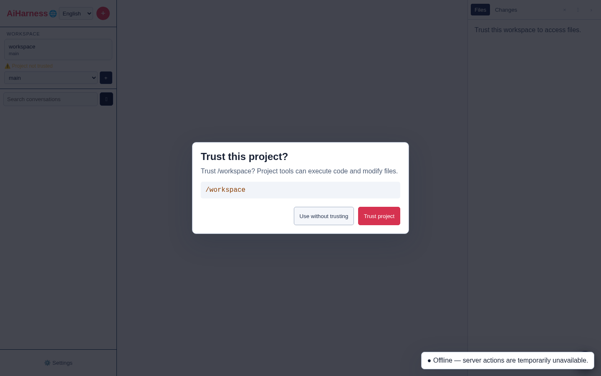

1. choose or confirm the workspace in the sidebar;
2. explicitly approve the project after verifying its path;
3. click **+** to open a local draft;
4. keep **Mock** provider in **Settings**;
5. send `Hello`: the session is only created on the server at this point.

### Configuring Web UI

The **Settings** page allows:

- selecting the active provider, registering a key with the server and tracking connection/usage;
- launching a configured OAuth Device Flow, then reconnecting or disconnecting the provider without exposing its token;
- creating, testing and deleting compatible providers and custom models, then importing announced models;
- administering the published or discovered catalog, its capabilities/prices, activation and global/project defaults;
- configuring presets and actually available tools, including PowerShell on Windows;
- reviewing skills by scope, authorizing their invocation and installing/updating from a registry;
- explicitly installing and administering global or project packages/plugins, their versions and resources;
- configuring subagent profiles and their global/project scope, then monitoring child agents;
- keeping SSE/WebSocket history transport for legacy chat endpoints;
- choosing System, Light, Dark, Mist, Rose or Pine themes;
- adjusting content width, font size and thinking expansion;
- enabling sound, browser notifications, Web Push and selection actions separately;
- restoring or hiding the sidebar and explorer;
- reconfiguring keyboard shortcuts, detecting conflicts and resetting to defaults;
- applying a Bearer token to the current tab or logging out of the Web session;
- viewing Web/agent versions, explicitly checking the latest release and opening its notes without auto-installation.

Expand **Manage model catalogue** in the **Model** section to search for a model or provider, view its reasoning/image/tool capabilities, then activate an entry, all entries or none. **Refresh catalog** re-triggers server-side discovery: local OpenAI/Ollama-compatible servers are queried via their models endpoint, then merged with a minimal published catalog and configured model. Discovery failure keeps the last valid result and the published catalog remains available.

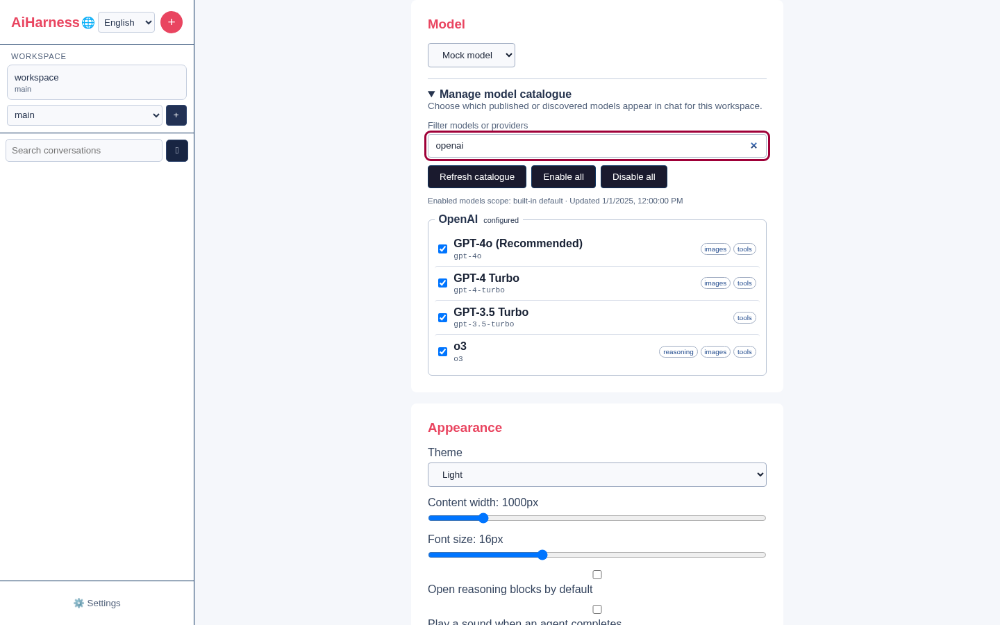

Activation is recorded with qualified identifiers `provider:model`. From a workspace, it creates project scope; without a project, the API uses global scope. Provenance displays in the panel. Disabled or unavailable models remain visible for administration but disappear from chat selector suggestions. Only activated **and** available models from the current provider are offered there. Under authentication, viewing requires user role and any modification demands `configuration` admin capability.

For local, Azure, Vertex or Bedrock providers, prefer server environment variables since they carry URL, project, region or model requirements too. The catalog and its cache contain no keys, auth headers or other credentials.

#### Authentication, Custom Providers and Models

**Provider lifecycle** shows the effective method (environment, key, OAuth or none), cumulative usage and actually available actions. The OAuth button opens a Device Flow; the code stays server-side, the browser never receives the access token. Configure each integration before startup:

```bash
export AI_HARNESS_OAUTH_OPENAI_DEVICE_URL='https://.../device'
export AI_HARNESS_OAUTH_OPENAI_TOKEN_URL='https://.../token'
export AI_HARNESS_OAUTH_OPENAI_CLIENT_ID='...'
export AI_HARNESS_OAUTH_OPENAI_SCOPE='...' # optional
```

Replace OPENAI with the provider name in uppercase. OAuth endpoints must be HTTPS, without embedded credentials. Cancellation invalidates the local Device Flow; reconnecting replaces the previous token.

**Manage compatible providers** accepts a stable identifier, name, HTTP(S) URL, dialect (OpenAI Chat Completions, OpenAI Responses, Anthropic Messages or Google Generative Language), optional key and JSON headers. You can test connectivity, import announced models, disconnect or delete entries. AiHarness deliberately executes no shell commands to obtain secrets.

**Custom models** lets you add any provider an ID and name, reasoning/image/tool capabilities, context window, max output, per-million-token input/output/cache prices and JSON compatibility settings. Custom metadata takes precedence over the published catalog. A connectivity test explicitly validates the entry; a model without tool calls disables tools for the run.

**Defaults and scope** sets provider, model and tool preset at global or project level. An empty value means "inherit"; effective value and provenance remain visible. A value imposed by environment is locked. **Tools** follows same scopes, lists actually registered tools and offers `configured`, `chat-only`, `read-only`, `default` and `full` presets. PowerShell is unavailable outside Windows and disabled by default even on Windows.

Metrics aggregate all provider turns including intermediate tool turns, compactions, titles and summaries. They distinguish input, output, cache read/write and cost calculated with custom or published prices. The server restores them from `usage-metrics.json` at restart.

The **Skills** section gathers discovered documents under **Project**, **Global**, **Configured paths** and **Packages**. Each line shows name, description, file, source, optional version and trust level. Filter applies to name, description and source; **Refresh skills** re-triggers bounded discovery. Server sources are `~/.agents/skills`, the data directory `skills/` and `packages/`, paths explicitly listed in `AI_HARNESS_SKILL_PATHS`, then `.agents/skills` and `.ai-harness/skills` of workspace.

A checked box authorizes the model to load this skill with read-only `load_skill` tool; it launches or installs nothing. The setting is written at current project level, or globally when no project provided, and provenance displays. A project skill remains locked and uninvocable before explicit workspace approval, even if its frontmatter enables it by default. On duplicate names, invocation prioritizes project, configured path, package then global. The browser never receives instruction bodies: only catalog metadata transit there. Under authentication, reading is accessible to user role but modification demands `configuration` capability.

Set `AI_HARNESS_SKILL_REGISTRY_URL` to an HTTPS index to open **Skill registry**. The panel searches metadata, installs at global or project scope, reports newer versions and applies update or all of the scope. Each registry entry must provide a `downloadUrl` HTTPS and SHA-256 of `SKILL.md`. Server limits index and documents, refuses redirects, embedded credentials and symlinks, verifies digest then atomically replaces installed version. Project installation requires approved workspace and reloads catalog without transmitting instructions to browser.

### Packages and Plugins

The **Plugins and packages** section groups **Project** and **Global** packages, then separately inventories standalone extensions from `.ai-harness/extensions/` and data directory. Installation is always an explicit action; viewing or refreshing the catalog contacts no registry and modifies no files. Three strict source forms are accepted:

```text
npm:@scope/package@^2.0.0
git:https://github.com/organization/repo.git#branch-or-tag
/absolute/path/to/a-package-or-extension.js
```

A Git source must use HTTPS, without credentials, query string or custom port. Allowed hosts are `github.com`, `gitlab.com` and `bitbucket.org` by default; `AI_HARNESS_PLUGIN_GIT_HOSTS=git.example.com,github.com` replaces this list. A local path must exist in server's allowed roots. Project scope is only available after explicit workspace approval.

npm and Git installations are copied to `~/.ai-harness/plugins/installed/` by staging then atomic rename. npm lifecycle scripts are disabled, Git clones are shallow and dev dependencies omitted. This reduces exposure during installation without making a third-party package trustworthy: always verify its source. An enabled executable extension runs as trusted Node code in the server process, without a security sandbox. Removing a local source only removes its AiHarness configuration, never the original folder.

Each card shows version, status, source and counts of extensions, skills, prompts and themes. **Disable/Enable** keeps the package but removes or restores its resources; **Remove** asks confirmation. **Check** and **Check all** are the only actions that query npm or Git repository. An update is also voluntary, prepared outside active installation then replaced with rollback if state write or installation fails. Local sources are read directly and have no remote verification.

**Refresh catalogue** only reruns the bounded inventory. **Reload resources** first validates every active package, then publishes one atomic generation; on failure, the previous generation remains active. If a persisted conversation is open, its ID binds the reload to the same workspace. Skills and prompts from enabled packages become available in their catalogs, and `load_skill` can load authorized skills. Enabled executable extensions are then loaded as one managed generation: their commands, providers, tools, text panels, hooks and listeners replace the previous generation together, without retaining stale handlers. Switching to a workspace whose generation is invalid removes handlers from the old project.

The browser catalogue contains sanitized metadata only: never a skill or prompt body, extension code, credentials, or command stdout/stderr. Discovery and loading are bounded, reject symlinks and modules larger than 5 MiB, and hide project resources when a workspace loses trust. With authentication enabled, mutations, checks, updates and reloads require the admin `packages` capability.

### Web Extensions and Interactions

Global extensions from the data directory, extensions in `.ai-harness/extensions/` for an approved project, and active packages feed the `/` palette and conversation panels after **Reload resources** or `/reload`. Reload prepares the complete generation before publishing it; an error in the same workspace keeps the previous valid generation active and displays a diagnostic.

An extension can publish a text widget or notice, or request a `confirm`, `input`, `select`, `editor` or `custom` interaction. Custom forms remain declarative: text fields, selects, checkboxes and buttons, never arbitrary HTML or DOM access. The dialog traps focus, accepts `Escape`, restores the composer and returns a structured response that the server validates again. If the tab is not visible, an interaction request can use the **attention** Push category. An interaction always requires an active run.

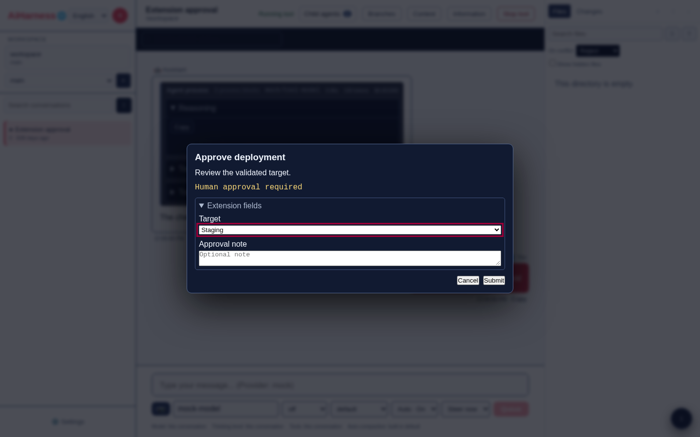

### Profiles and Child Agents

The **Sub-agents** section enables or disables the integrated engine and sets the number of simultaneous children (1 to 16, four by default). Choose **Project workspace** to create an override for the current workspace or **Global defaults** to change the shared base. Built-in profiles are:

- **Explore**: read-only inspection, inherited context, background by default;
- **General purpose**: a general task using the parent tool policy;
- **Plan**: read-only analysis, high thinking and synchronous waiting by default.

A custom profile has a stable ID (generated when the field is empty), a name, description and instructions. Comma-separated lists restrict tools, skills and extensions; an empty list inherits everything allowed by the parent preset. Empty model and thinking values also inherit from the parent. You can limit turns, include or omit a context excerpt, choose background execution, and enable, edit, duplicate or delete a custom profile. A built-in profile can be edited and duplicated, but not deleted. Profile mutations require the admin `configuration` capability.

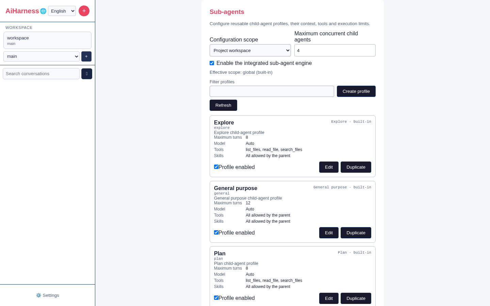

During an agent run, the model can call `spawn_subagent` with a profile ID, bounded task and optional `background` flag. The server requires an approved workspace, limits delegation to three child levels and passes at most 40 messages or 120,000 characters. Each child becomes a persisted session linked to its parent and respects its tool, skill and extension allowlists. A synchronous child returns its result directly to the parent; a background child continues after the parent conversation is completed or navigated away from.

The **Child agents** button in the conversation header shows run count, task, state, phase and progress. A badge marks a completed, failed or stopped run that needs attention. Opening the panel acknowledges the badge; **Open details** opens the child session, **Back to parent agent** returns to the parent, and **Stop child agent** cancels an active run. An internal notification remains in the status center when a run finishes. Child sessions survive a restart, but progress records for completed runs are retained only for the lifetime of the current server process.

The **Apply** button keeps a compatibility Bearer token in per-tab `sessionStorage`. When authentication is required, the login page instead exchanges that token for an opaque `HttpOnly` session cookie, so JavaScript cannot read the secret. Versioned preferences and the legacy transport choice are stored in `localStorage`, never provider credentials.

### PWA Installation and Offline Mode

The production bundle publishes an installable manifest. In a compatible browser, **Install app** adds AiHarness as a standalone application. The service worker caches only the shell and static resources; `/api` routes and conversation data are never placed in its cache.

Offline, the shell reports that server actions are unavailable and offers a retry. Agents that are already running continue on the server and resynchronize when the network returns. When a new bundle is ready, a banner lets you choose when to activate it rather than silently reloading an active conversation.

In preferences, **Web Push** asks for permission only when explicitly enabled. The **completion** and **attention** categories are independent from sound and local notifications. Clicking a notification opens the relevant conversation; a tag prevents duplicates, and the service worker displays nothing when a visible AiHarness client already handles the event. This also covers an iOS home-screen PWA.

The server generates its VAPID keys. With `AI_HARNESS_MASTER_KEY`, keys and subscriptions are encrypted in `push.enc`; without it they are volatile and the browser must subscribe again after rotation or restart. `AI_HARNESS_VAPID_SUBJECT` can set the VAPID contact, for example `mailto:admin@example.com`. Outside tests, only HTTPS endpoints resolving to public addresses are accepted.

The **About** section checks the latest published release in the background with a short timeout and a six-hour server cache. An available release is never installed automatically: its link and notes are shown as text. A failure remains unobtrusive in a collapsed diagnostic panel. For an isolated installation, disable the call with `AI_HARNESS_DISABLE_UPDATE_CHECK=1`; `AI_HARNESS_UPDATE_CHECK_URL` can target a GitHub Releases-compatible metadata endpoint.

### Interface Language

The interface is available in English and French. On the first visit, AiHarness selects the first compatible language declared by the browser and falls back to English. The 🌐 selector in the sidebar header changes language immediately. The choice is stored in `localStorage` under `ai-harness-locale`.

To add a language pack or modify interface text, see the [internationalization guide](../../contributors/en/i18n.md).

### Workspaces, Trust and Worktrees

The workspace button opens a directory browser. It accepts an absolute path or `~`, supports navigation to the parent, and remembers recent projects. The `?cwd=` parameter makes a workspace shareable without creating a conversation.

Approval is deliberate: verify the displayed canonical path before confirming. Approval enables tools, commands and writes in that project. A path outside allowed roots or an escaping symlink is rejected.

In a Git repository, the selector shows the branch and worktrees. The adjacent **+** button creates a worktree from an existing or new branch. Removing a worktree requires confirmation. Running agents stay bound to the cwd where they started. Switching immediately clears stale search and explorer results, unmounts PTY surfaces from the old cwd, then separately restores drafts, provider/models, skills, plugins, child-agent profiles, trust and tabs for the target workspace.

Useful server variables:

```bash
export AI_HARNESS_DEFAULT_CWD="$HOME/projects/my-project"
# Colon-separated on Unix and semicolon-separated on Windows.
export AI_HARNESS_ALLOWED_ROOTS="$HOME/projects:/srv/sources"
export AI_HARNESS_DATA_DIR="$HOME/.ai-harness"
```

### Conversations and Detached Agent

- **+** creates a workspace-bound local draft; it is persisted only on first send;
- draft text, images and settings survive internal navigation and a full reload within the bounded per-tab cache;
- sidebar search queries titles and content, displays a snippet and opens the target message, loading an older history window when necessary;
- hover actions provide inline rename, provider-assisted short titles and confirmed deletion. Nested branches trigger a second confirmation with the cascade count; dates, counters and run/unread/attention indicators stay bound to the correct workspace;
- opening the application root restores the last valid conversation for the workspace. Header arrows move to the previous or next conversation; a deleted-session link shows a recoverable state instead of retrying forever;
- **Branches**, **Info** and per-message actions expose the tree, **Edit from here**, **New chat from here**, full diagnostics, copy and export;
- long conversations start with the latest 80 messages. **Load earlier messages** adds a page without moving the read turn; above 120 messages only visible rows render while preserving the reading anchor. An explicit separator can fill an omitted range around a search result;
- **Conversation map** lists roles and previews for loaded entries, jumps to a selected turn, returns to recent messages and downloads full history without loading it into the browser;
- when reading older history, new messages do not move the viewport. **Back to bottom** shows their count. Position and visible anchor are stored per conversation/workspace and restored with virtualization and historical pages;
- the agent continues on the server if the tab navigates or disconnects; the UI reloads the snapshot and resumes missing events;
- the stop button identifies the active phase: model wait/response, tool, shell command or compaction. Cancellation propagates to the active provider or tool;
- a failure before the first delta can retry automatically without duplicating an assistant response. Attempt number, limit and latest error remain visible and survive snapshot reconnection.

The latest view is cached in per-tab `sessionStorage` for display before network reconciliation. Schema v2 migrates v1 snapshots, expires after 24 hours, and is bounded to 2 MiB, three remote sessions and three local drafts per workspace. It restores the active conversation or draft, text, settings, small attachments and provider/model selection; binary previews are evicted before text when the budget is reached. No API key is written there. The server remains authoritative and replaces a remote window when its revision changes. A separate scroll registry also expires after 24 hours, keeps at most 24 conversations per workspace and writes on a delay. Browser preferences use schema v3 with v1/v2 migration; PTY tabs remain isolated by workspace, and every storage path has a safe fallback.

During a run, choose **steer** to influence the active turn or **follow-up** to send after its response. Both queues display their content, survive reconnection and can be cleared. Click a queued message to return it to the composer without silently removing it.

The four controls below the composer set model, thinking level, tool preset and auto-compaction. Each list offers **Auto**, displays the inherited value and identifies its source: built-in, global, workspace/project, conversation or environment. Priority is `built-in < global < workspace < conversation < environment`. An explicit selection becomes a persisted conversation override; returning to **Auto** removes that override instead of copying the current value. An environment-enforced value is visible but locked. **Context** displays the effective system prompt and schemas of tools allowed by the active preset; it refreshes after a setting change or `/reload`.

Deployments can enforce top-priority values with `AI_HARNESS_DEFAULT_MODEL`, `AI_HARNESS_DEFAULT_THINKING` (`off`, `low`, `medium`, `high`, `xhigh`, `max`), `AI_HARNESS_DEFAULT_TOOL_PRESET` (`configured`, `chat-only`, `read-only`, `default`, `full`) and `AI_HARNESS_AUTO_COMPACTION` (`true`/`false`, `on`/`off`, `1`/`0` or `yes`/`no`).

### Composer, Commands and Compaction

The composer is multiline and auto-sizing. `Enter` sends, `Shift+Enter` adds a line, and `↑`/`↓` recalls history when the input has one line. IME input is not sent while composition is active.

Type `@` to fuzzy-search workspace files **and** directories. The palette accepts `↑`/`↓`, `Enter`, `Tab`, `Escape` and the mouse. It first filters the local index, then queries the server if that index was truncated; a path containing spaces is inserted in quotes automatically.

Built-in Web commands:

| Input | Effect |
|---|---|
| `/compact [instruction]` | summarizes old context and shows before/after tokens |
| `/auto-compact [auto\|on\|off]` | queries or changes conversation auto-compaction policy |
| `/clone` | creates an independent copy |
| `/copy` | copies last assistant response |
| `/name <title>` | renames the conversation |
| `/reload` | reloads session information |
| `/stats` | opens info panel |
| `!command` | executes in workspace and includes output in model context |
| `!!command` | executes, persists output but excludes it from model context |

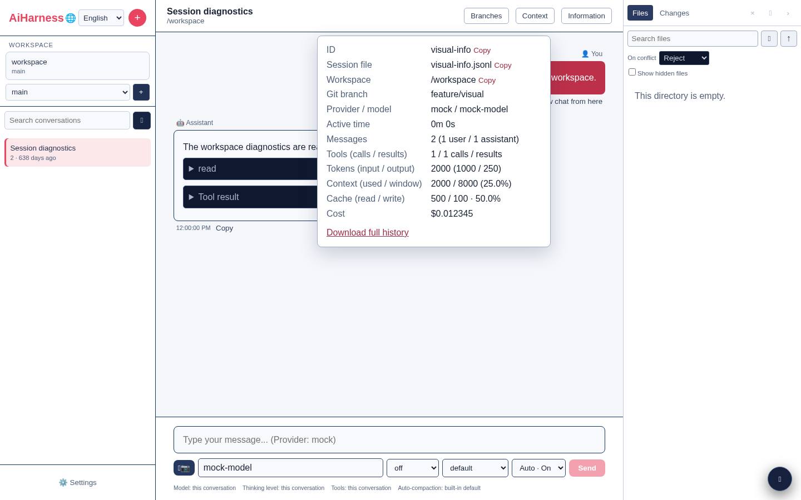

Shell commands show progressive output, status code and can be cancelled. They remain distinct from PTY terminal: `!` and `!!` produce a session result for context, while the terminal is interactive and does not automatically send its output to the model.

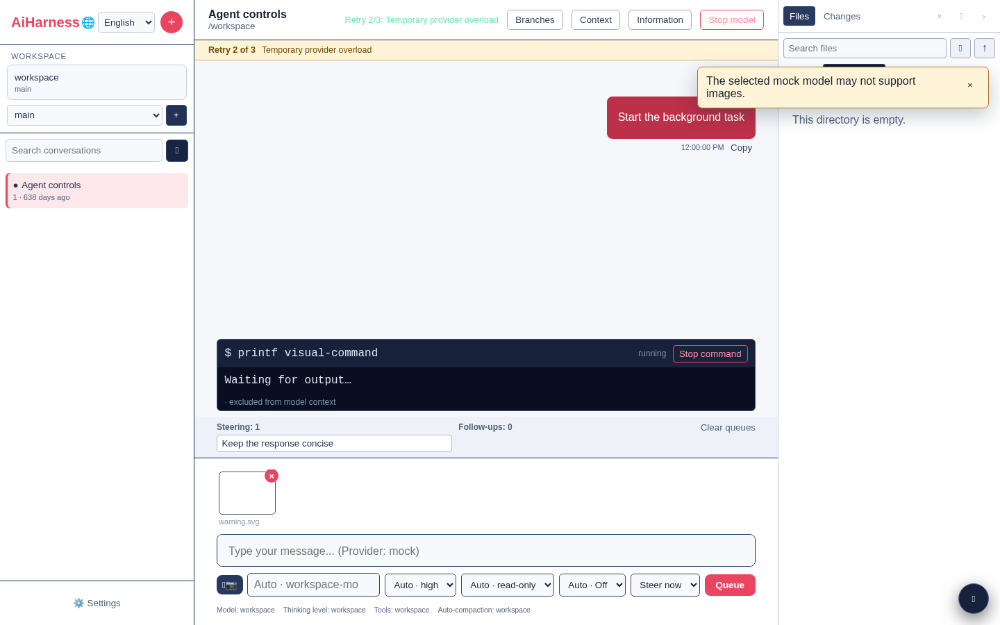

**/compact** accepts free instructions, shows before/after tokens and number saved. Auto-compaction applies effective policy when context budget requires it; selector or `/auto-compact auto|on|off` lets you restore inheritance, enable or disable for the conversation. Manual or automatic compaction displays its state and can be cancelled from phase button while provider works: stop signal reaches summary generation and no partial summary is applied. On success, canonical context and visible history reload together so replaced messages do not reappear in replaced-by-summary.

Successes, warnings, provider/scope/extension errors and progressions appear in a global status center: its messages survive navigation, expiration suspends on hover or focus, each message can be closed with keyboard.

### Global Palette and Shortcuts

**Ctrl+K** (Cmd+K on macOS) opens a global palette that searches commands, sessions, settings and workspace files. Use Up/Down, Enter and Escape to browse it. Focus remains trapped in the palette while open, then returns to previous control.

Default shortcuts:

| Action | Windows/Linux | macOS |
|---|---|---|
| New conversation | Ctrl+Shift+O | Cmd+Shift+O |
| Composer focus | Ctrl+L | Cmd+L |
| Toggle sidebar | Ctrl+Shift+S | Cmd+Shift+S |
| Toggle explorer | Ctrl+Shift+F | Cmd+Shift+F |
| Toggle terminal | Ctrl+Shift+T | Cmd+Shift+T |
| Open settings | Ctrl+, | Cmd+, |

Global shortcuts do not capture ordinary input in an editable field. Their configuration and panel visibility are validated then stored in browser preferences.

### Images and Message Rendering

Add up to eight images via camera button, paste or drag-and-drop. Browser attempts to reduce oversized images; total size is limited. A warning appears if chosen provider does not announce multimodal support. Image blocks persist with message and send natively to OpenAI/Azure, Anthropic and Gemini/Vertex.

Responses support titles with anchors, lists, tables, quotes, links, colored and copyable code, KaTeX math, reasoning and tool details. Their footer shows timestamp, model, available tokens/cost and a copy button with visual confirmation; files produced by tools are buttons that open viewer directly. Mermaid blocks load on demand and have sanitized SVG preview, source, accessible zoom and download; unsupported syntax produces local error without injecting active content. Raw HTML stays as text, KaTeX outputs are sanitized with trust mode disabled and external links use isolated opening.

Each tool turn groups into **Process** then **Response**. Process exposes name, arguments, progress, result or error, duration, provider/model, tokens and cost. ANSI sequences render without active HTML. Long output remains bounded in preview and model context; **Show complete output** explicitly loads full version, which can then be copied or downloaded.

HTML paste in composer converts to useful Markdown (titles, lists, emphasis, links and code) after removing active elements like script, style and iframe.

When **selection actions** option is active, selecting text in conversation opens an accessible bar allowing you to quote it in current composer or create a new pre-filled draft. Quotation preserves line breaks and focus returns to composer without sending message.

### Explorer, Git and Files

Right panel offers:

- lazily loaded tree, optional hidden files, index search and M/A/D/U Git badges;
- Git changes grouped by folder, with add/delete totals and direct diff opening;
- resizable or fullscreen Source/Preview/Diff viewer with metadata, line numbers, coloring, copy and download;
- sanitized Markdown preview with frontmatter and anchors, plus images, audio and video files;
- followed, indexed, untracked, deleted or binary diffs, refreshed when open file changes;
- cancellable multiple upload with per-file network progress, detailed error and explicit collision strategy: reject, rename or overwrite;
- **@** button that inserts selected relative path directly into composer, auto-quoting if it contains spaces.

A Markdown `file:src/app.ts#L20` link or recognized path in tool output opens viewer at targeted line. All these operations are resolved and canonicalized by server inside approved workspace. Upload is bounded in count and size; overwrite only occurs if that strategy was selected.

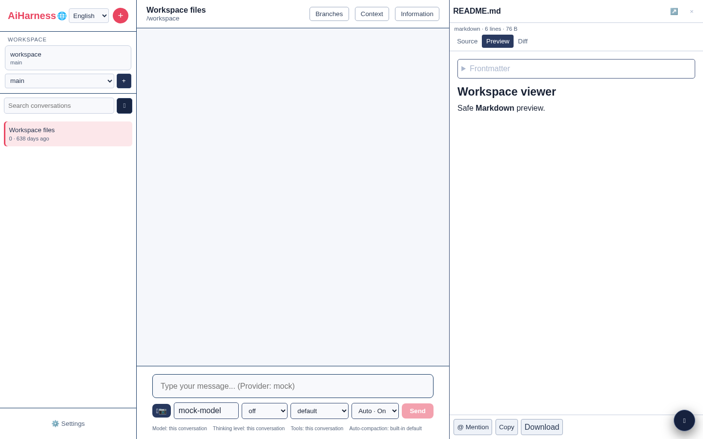

### Workspace Terminal

The Cmd button or shortcut Ctrl+Shift+T loads then opens a real PTY terminal in approved cwd; xterm does not download before first request. Each tab has its own shell and displays status, dimensions and exit code. **+** button creates another terminal; closing active tab asks confirmation then kills process.

Size follows panel. Ctrl+Shift+C copies xterm selection and Ctrl+Shift+V pastes clipboard when browser allows it. Tabs and active terminal are remembered in `sessionStorage` by workspace for current browser tab. After reload or network cut, client resumes ANSI journal at last offset; explicitly signals if oldest part evicted from bounded journal.

Server limits PTY count, input size and dimensions. Creation, input, resize and close demand terminal capability plus approved canonical workspace. Initial environment built by whitelist and does not inherit server auth tokens nor provider keys. All active PTY stop with server. A terminal can still execute commands with server system user rights: only give terminal capability to trusted administrators.

### Mobile and Tablet Screens

Below 960px, sidebar and explorer become stacked drawers accessible via top-of-screen buttons. Chat takes full width, secondary actions move to mobile bar, viewer can take full screen and terminal stays anchored above PWA safe zone. Drawer background closes active panel; Escape closes dialogs and palettes.

Sessions load from server at startup. Multiple tabs see same server storage after reload; appearance preferences synchronized via browser events.

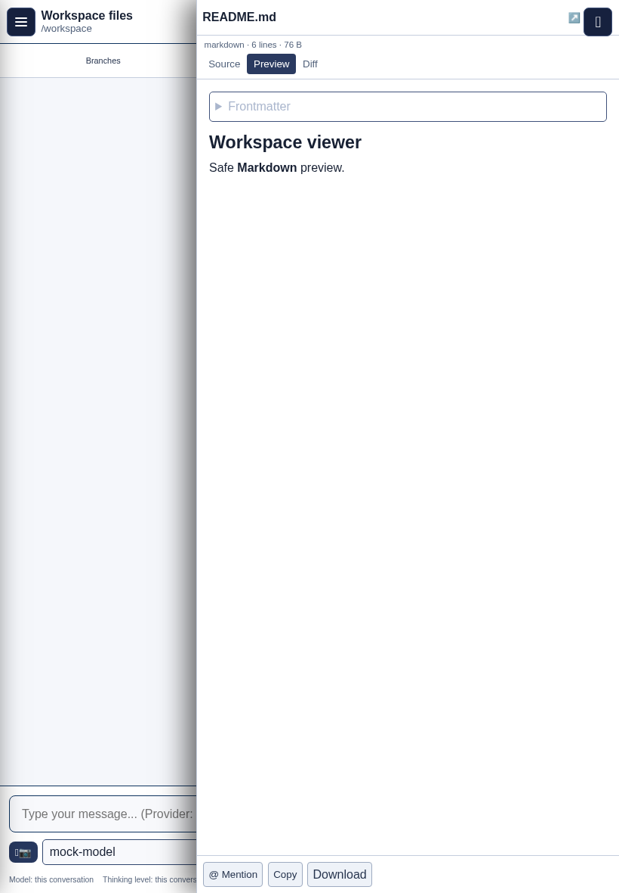

### Accessibility

Palettes, dialogs, zooms and mobile drawers trap focus without losing it at close and accept Escape. Conversation and error zones use non-blocking ARIA announcements, controls have accessible labels and active states do not rely solely on color. AiHarness respects `prefers-reduced-motion` and system forced colors.

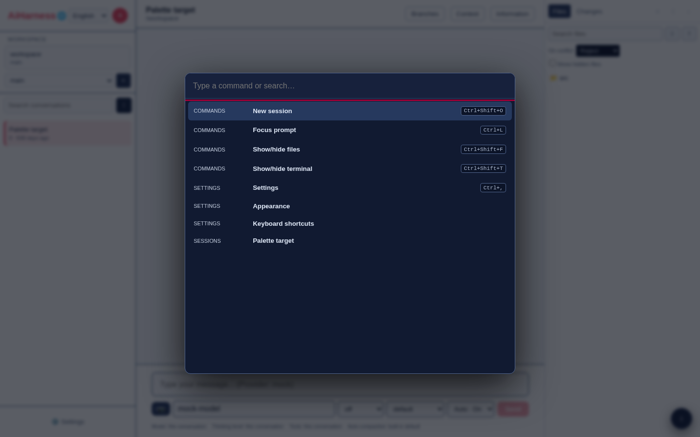

### Post-Build Execution Without Global Link

After `npm run build`, the same launcher remains directly accessible:

```bash
node packages/server/dist/web-cli.js --no-open
```

The `packages/web/dist/` bundle is served automatically with API. No second HTTP server needed. For public production, still place `ai-harness-web` behind an HTTPS reverse proxy.

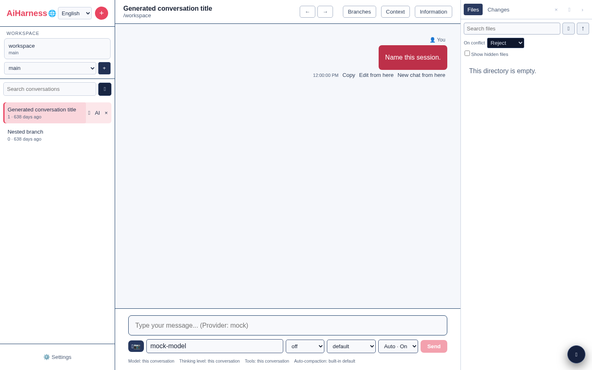
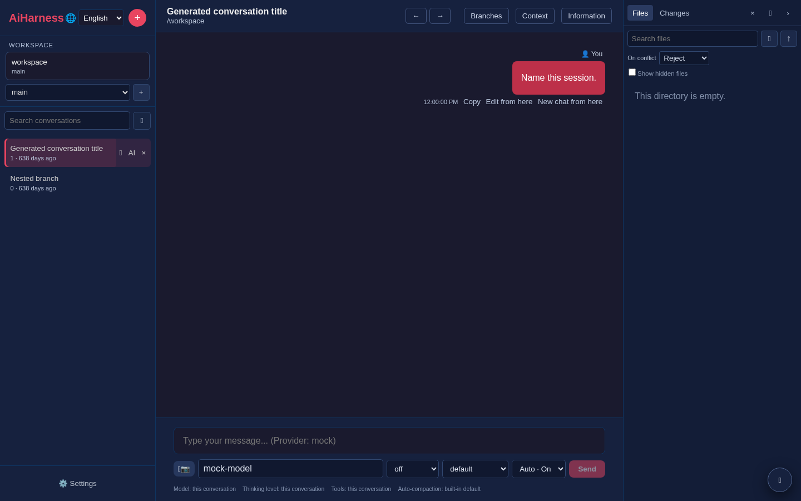

## Sessions and Files

By default, CLI and server use:

| Data | Location |
|---|---|
| JSONL sessions | `~/.ai-harness/sessions/<id>.jsonl` |
| CLI exports | `~/.ai-harness/exports/` |
| Encrypted Web credentials | `~/.ai-harness/credentials.enc` |
| Non-secret config by scope | `~/.ai-harness/config.json` |
| Custom providers/models | `~/.ai-harness/providers.json` |
| Custom provider secrets (if master key) | `~/.ai-harness/provider-secrets.enc` |
| Usage and cost metrics | `~/.ai-harness/usage-metrics.json` |
| Web Push subscriptions/private key (if master key) | `~/.ai-harness/push.enc` |
| Packages/plugins state | `~/.ai-harness/plugins.json` |
| Managed npm/Git packages | `~/.ai-harness/plugins/installed/` |
| Project trust | `~/.ai-harness/trust.json` |
| User extensions | `~/.ai-harness/extensions/` |
| User skills | `~/.ai-harness/skills/` |
| User prompts | `~/.ai-harness/prompts/` |

CLI and Web share sessions when running with same user and home directory. Backup `~/.ai-harness/` to preserve conversations.

The CLI `--no-session` mode disables reads and writes. For a container, mount a private volume on effective user's `.ai-harness` folder; see [containerization.md](./containerization.md).

## Security

### Protecting Web API

Set an authentication token before starting the server:

```bash
export AI_HARNESS_AUTH_TOKEN="$(openssl rand -hex 32)"
```

All `/api` routes then require authentication. With no distinct admin token, this token also has admin capabilities. The browser displays a login page and receives, after validation, an opaque `HttpOnly`, `SameSite=Strict` session cookie that expires after eight hours by default. API clients can continue sending `Authorization: Bearer <token>`.

A separate admin token can protect credential changes:

```bash
export AI_HARNESS_AUTH_TOKEN='user-token'
export AI_HARNESS_ADMIN_TOKEN='admin-token'
```

User token allows chat, sessions and reads; admin role required for trust/worktrees, upload, terminal, configuration, credentials and packages/plugins administration. To persist encrypted Web keys between restarts:

```bash
export AI_HARNESS_MASTER_KEY="$(openssl rand -hex 32)"
```

Without `AI_HARNESS_MASTER_KEY`, keys sent from Settings, custom provider secrets and Push subscriptions stay in memory only until restart. Keys provided directly via environment variables remain recommended method in production. Encrypted files never served to browser; changing master key makes old content unreadable and triggers secure Push data rotation.

For `/share` links, configure correct public URL:

```bash
export AI_HARNESS_PUBLIC_URL='https://ai.example.com'
```

### Network Listening

Server listens only on `127.0.0.1` by default. For explicit network listening:

```bash
ai-harness-web --hostname 0.0.0.0 --port 3080 --no-open
```

Server now refuses non-loopback address without `AI_HARNESS_AUTH_TOKEN` or `AI_HARNESS_ADMIN_TOKEN` (except explicit dangerous override `AI_HARNESS_ALLOW_INSECURE_REMOTE=1`). Place behind HTTPS reverse proxy, keep correct origin/host and also apply rate limiting at proxy. To allow additional origins:

```bash
export AI_HARNESS_ALLOWED_ORIGINS='https://ai.example.com,https://admin.example.com'
```

HTTP mutations and WebSocket upgrades refuse unauthorized origins. Web session duration adjustable between five minutes and seven days with `AI_HARNESS_WEB_SESSION_TTL_MS`.

## Troubleshooting

### Web shows HTTP error or does not create session

- verify `ai-harness-web` runs on chosen port;
- open `http://127.0.0.1:3080/health` with defaults;
- from sources, use `npm run web` to start API and Vite together;
- if API protected, apply correct token in Settings.

### "Workspace not approved" or PROJECT_TRUST_REQUIRED

Open workspace selector, verify path then click usage action and confirm approval. If path refused before this step, add its canonical root to `AI_HARNESS_ALLOWED_ROOTS` then restart server. Do not bypass this check for unknown repository.

### "Provider not configured"

- export variables before starting process;
- restart CLI or server after modification;
- in CLI, run `/provider` then `/provider <name>`;
- in Web, verify active provider in Settings.

### Local provider does not respond

```bash
curl http://127.0.0.1:11434/v1/models
```

Adapt `LOCAL_BASE_URL`, verify `LOCAL_MODEL` name and ensure model is loaded. In container, localhost refers to container itself: use service DNS name or host.docker.internal depending on environment.

### Fullscreen does not work

Use:

```bash
npm run dev --workspace @ai-harness/cli -- --regular
```

CLI automatically falls back to classic mode when stdin/stdout are not TTY-compatible.

### Clipboard unavailable

On Linux, install wl-copy, xclip or xsel. CLI otherwise tries OSC 52 then displays content if no method available.

### Reset local configuration

Stop AiHarness and backup before deletion:

```bash
mv ~/.ai-harness ~/.ai-harness.backup
```

New folder created at next startup.